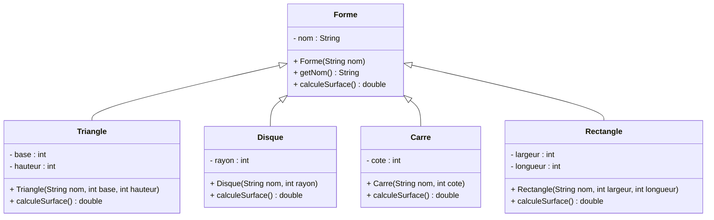
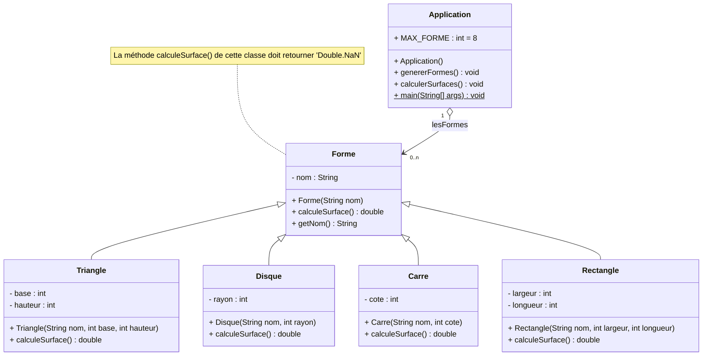
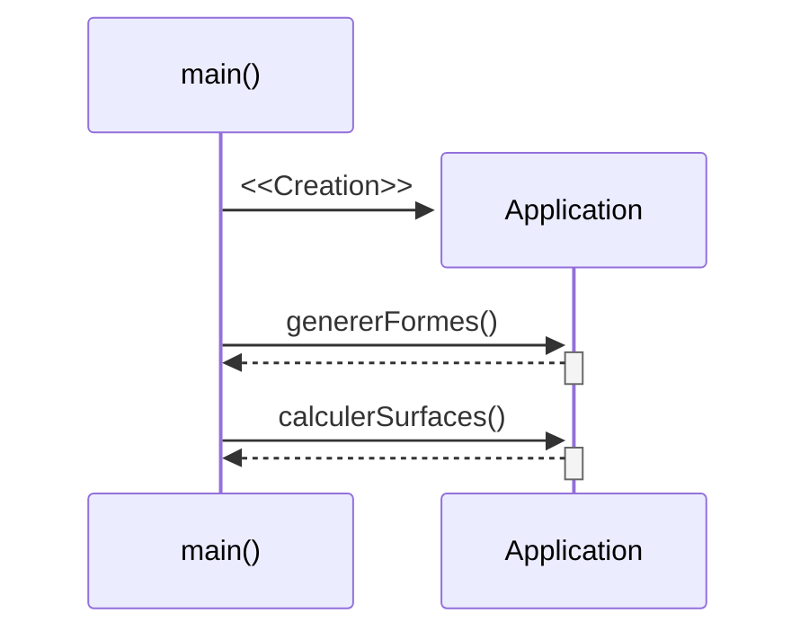
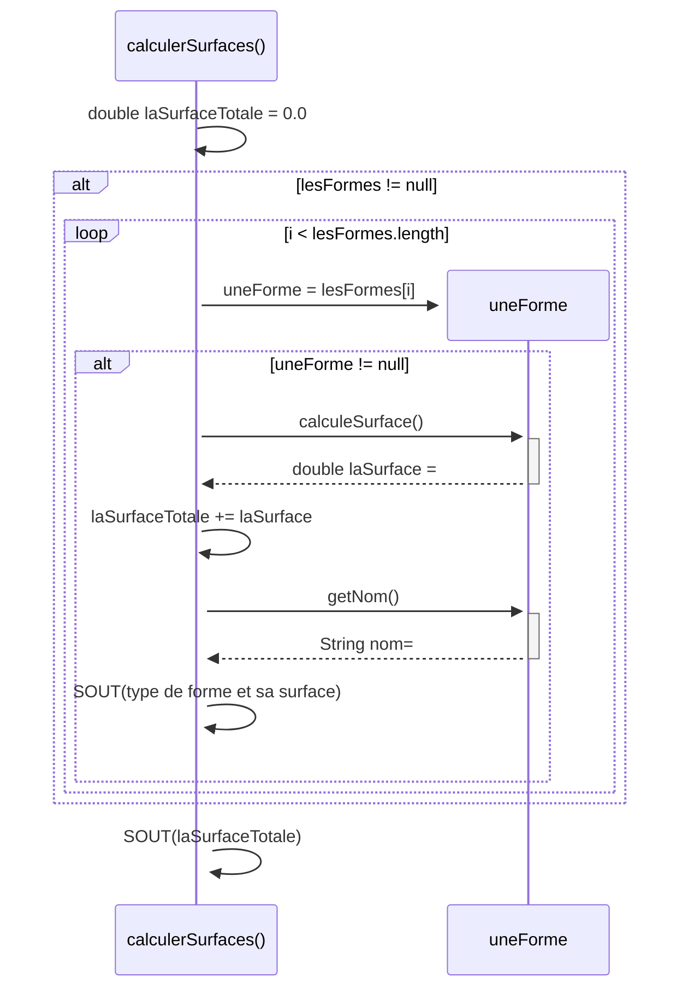
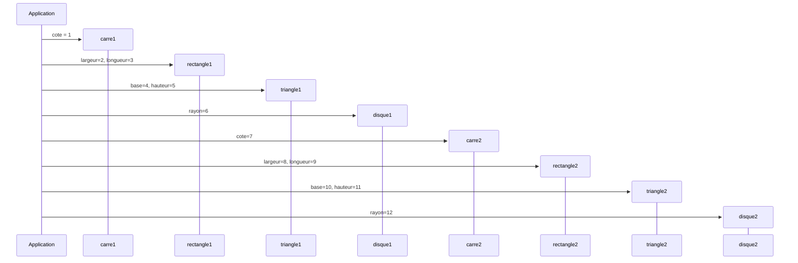

# Les Formes

## Durée : 45'

## Objectifs
- Réactivation des fondamentaux Java : classes et objets.
- Mise en pratique de l'héritage.

## L'héritage

En Java, l'héritage est un mécanisme qui permet de créer de nouvelles classes à partir d'une classe existante. La classe qui sert de base est appelée classe parente (ou superclasse), tandis que la classe qui en hérite est appelée classe fille (ou sous-classe). L'idée est de réutiliser les attributs et les méthodes déjà définis afin d'éviter de dupliquer le code et de structurer proprement un programme orienté objet.

On dit souvent que la relation entre une classe fille et sa classe mère suit le principe "est-un" : un `Carre` est une `Forme`, un `Rectangle` est une `Forme`, etc. Cela permet de modéliser les objets du monde réel de manière logique et cohérente.

### Caractéristiques principales de l'héritage

**Réutilisation du code** : une sous-classe hérite des méthodes et des attributs protégés ou publics de la superclasse.

**Spécialisation** : la classe fille _ajoute_ de nouvelles fonctionnalités ou redéfinit certaines méthodes pour adapter le comportement.

**Hiérarchie de classes** : plusieurs classes peuvent hériter d'une même superclasse, créant ainsi une structure hiérarchique.

**Mot-clé `extends`** : pour indiquer qu'une classe hérite d'une autre, on utilise le mot-clé `extends`.

**Méthode `super()`** : le constructeur de la superclasse peut être appelé depuis le constructeur de la sous-classe via `super(...)`.

**Redéfinition (`@Override`)** : une sous-classe peut réécrire une méthode de la superclasse pour la rendre spécifique.

**Héritage unique** : en Java, une classe ne peut hériter que d'une seule classe parente. En revanche, une classe peut implémenter plusieurs interfaces.

### Exemple concret avec les formes

Dans cet exercice, la classe `Forme` sert de base commune à toutes les formes géométriques. Chaque forme a un nom, et chacune possède sa propre manière de calculer sa surface.



### Exemple de code

```java
public class Animal {
    private String nom;

    public Animal(String nom) {
        this.nom = nom;
    }

    public String getNom() {
        return nom;
    }

}
```

```java
public class Chat extends Animal {
    private String race;

    public Chat(String nom, String race) {
        super(nom);
        this.race = race;
    }

    public void miaule() {
        System.out.println("Miaou!");
    }
}
```

Dans cet exemple, `Chat` hérite de `Animal` grâce à `extends Animal`. Le constructeur de `Chat` appelle d'abord `super(nom)` pour initialiser le nom de l'animal. Ensuite, la méthode `miaule()` est ajoutée.

### Pourquoi c'est utile ?

L'héritage permet de :

- regrouper les éléments communs dans une classe mère
- éviter la duplication de code
- spécialiser le comportement dans chaque sous-classe
- manipuler plusieurs objets de types différents via une même référence de type parent

Par exemple, on peut stocker plusieurs objets de type `Forme` dans un tableau, même si certains sont des carrés, des triangles ou des disques. Cela permet d'écrire une logique commune tout en laissant chaque objet calculer sa propre surface.

### À retenir

L'héritage est un pilier de la programmation orientée objet. Il permet de construire des classes hiérarchisées en réutilisant le code et en ajoutant des spécificités. C'est exactement ce que nous allons mettre en pratique dans cet exercice : une classe `Forme` commune, puis des sous-classes plus spécifiques pour chaque type de figure.

## Travail à réaliser

Créez un nouveau projet java.

Ajoutez y les classes suivantes :
- Une classe `Carre`
- Une classe `Rectangle`
- Une classe `Disque` 
- Une classe `Triangle` 
- Une classe `Forme`

Chacune de ces classes doit avoir les attributs et les méthodes nécessaires pour calculer sa propre surface.


Créez ensuite une classe `Application` possédant une méthode `main` respectant les diagrammes de séquences suivants:

### Méthode main(String[] args)


### Méthode calculerSurfaces()



### Méthode genererFormes()


## Résultat attendu
> La surface de la forme 0 qui est un Carré est de [1.0]</br>
> La surface de la forme 1 qui est un Rectangle est de [6.0]</br>
> La surface de la forme 2 qui est un Triangle est de [10.0]</br>
> La surface de la forme 3 qui est un Disque est de [113.09733552923255]</br>
> La surface de la forme 4 qui est un Carré est de [49.0]</br>
> La surface de la forme 5 qui est un Rectangle est de [72.0]</br>
> La surface de la forme 6 qui est un Triangle est de [55.0]</br>
> La surface de la forme 7 qui est un Disque est de [452.3893421169302]</br>
> La surface totale des formes est de 758.4866776461628
