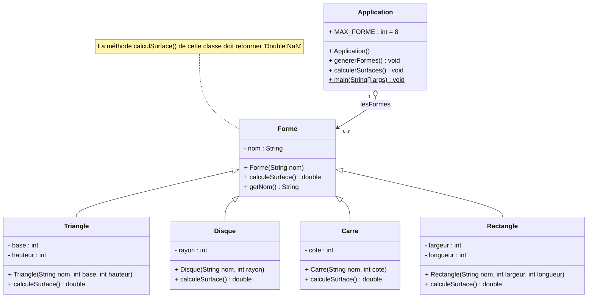
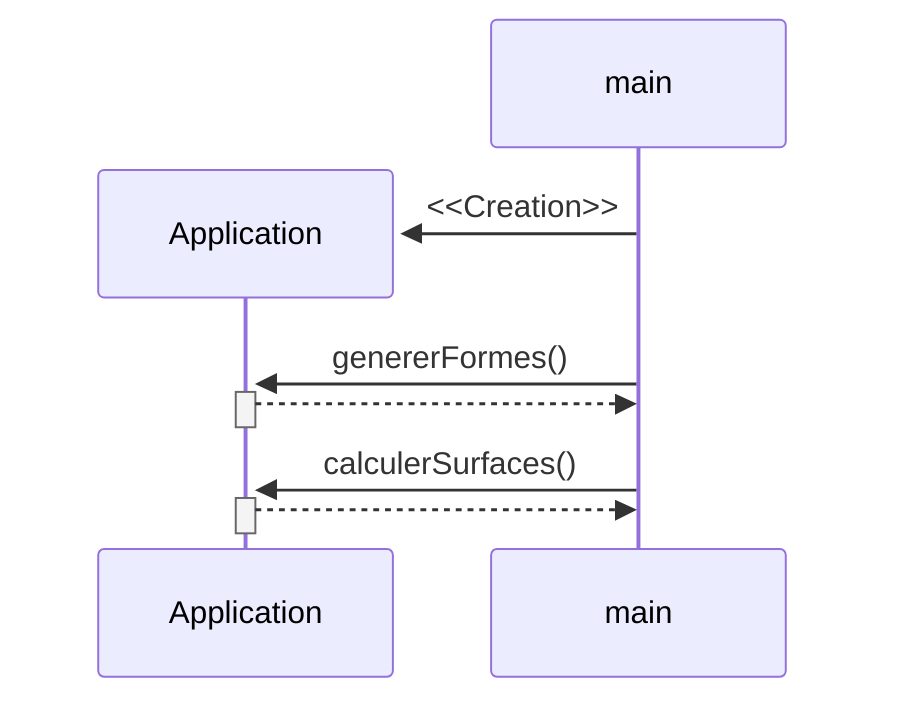
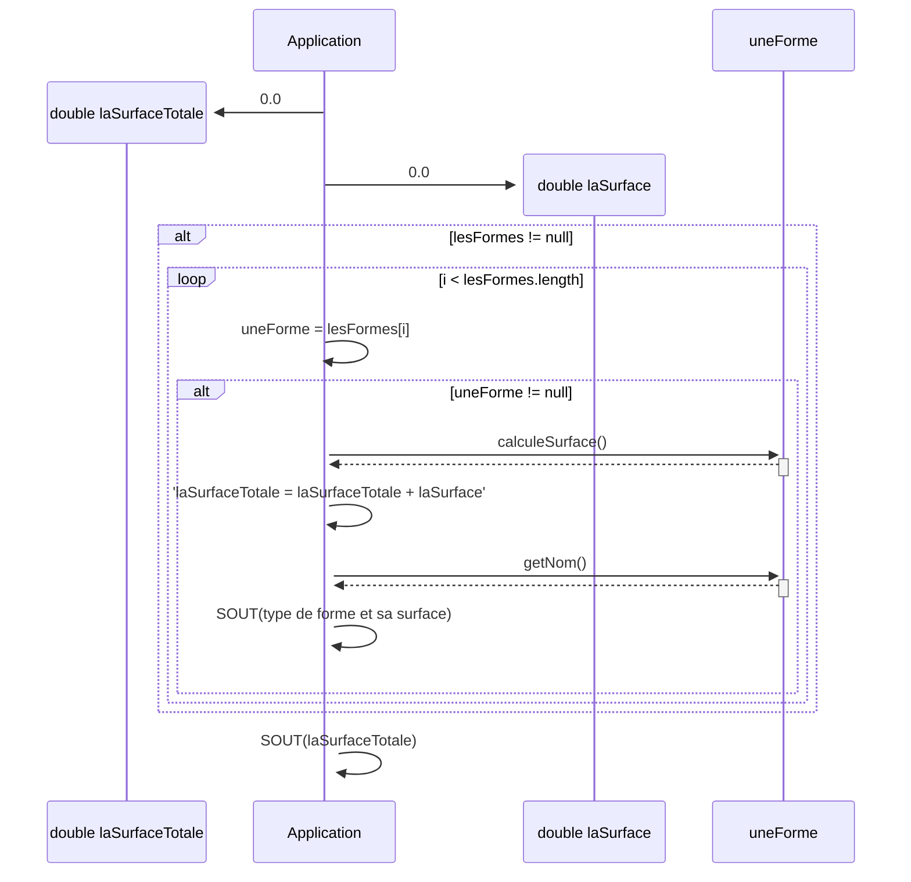
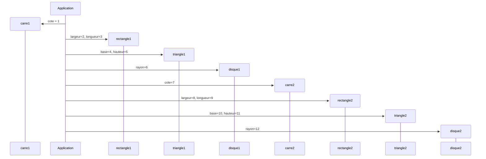

# Les Formes

## Durée : 45'

## Objectifs
Réactivation des fondamentaux Java : classes et objets.
Mise en pratique de l'héritage.

## Travail à réaliser

Créez un nouveau projet java.

Ajoutez y les classes suivantes :
- Une classe `Carre`
- Une classe `Rectangle`
- Une classe `Disque` 
- Une classe `Triangle` 
- Une classe `Forme`

Chacune de ces classes doit avoir les attributs et les méthodes nécessaires pour calculer sa propre surface.

Créez ensuite une classe `Application` possédant une méthode `main` respectant les diagrammes de séquences suivants:

### Méthode main(String[] args)

### Méthode calculerSurfaces()

### Méthode genererFormes()

## Résultat attendu
> La surface de ce [Carré] qui a [4] côtés est de [1.0] 
> La surface de ce [Rectangle] qui a [4] côtés est de [6.0] 
> La surface de ce [Triangle] qui a [3] côtés est de [10.0] 
> La surface de ce [Disque] qui a [infinité] côtés est de [113.09733552923255] 
> La surface de ce [Carré] qui a [4] côtés est de [49.0] 
> La surface de ce [Rectangle] qui a [4] côtés est de [72.0] 
> La surface de ce [Triangle] qui a [3] côtés est de [55.0] 
> La surface de ce [Disque] qui a [infinité] côtés est de [452.3893421169302] 
> La surface totale des formes est de 758.4866776461628
